# Deravelについて
**Deravel**は、名古屋を訪れた外国人の体験を「文化 × ストーリー」として世界に届けるUGC（User Generated Content）型ブログプラットフォームです。
 

## アプリ概要
### コンセプト
ストーリー形式で名古屋のローカル文化（喫茶店・モーニング・サブカルなど）を可視化し、名古屋を知らない外国人が文化への興味から「行ってみたい」につながる導線をつくります。

### 現状の課題点
1. **観光地としての名古屋**
  - 名古屋は東京や大阪、京都などと比べて観光地としての強みが薄い
2. **名古屋としての知名度**
  - 観光地として少し引けを取るため、SNSでの発信も少ない。
  - 東京、大阪などと比べると知名度は低い

**=> 結論として、名古屋を日本の初めての旅行先に選んでもらうのは難しい現状があります。**

### 名古屋の強み

名古屋には、**「生活文化」として体験できる独自の魅力**があります：

- **喫茶店文化とモーニング** - レトロな空間で過ごす朝の時間
- **大須商店街のサブカル** - 古着・雑貨・アニメ文化が集まる街の雰囲気
- **味噌文化と名古屋めし** - ひつまぶしをはじめとした地元グルメ などなど

 

これらは「観光」ではなく「体験」として価値を持つ文化であり、実際に訪れた人のストーリーを通じて伝わるものです。 s

### 解決策

名古屋の文化を伝えるためには、**旅行者のリアルな声をストーリー形式で可視化する**ことが重要です。 

本アプリでは、以下のアプローチで課題を解決します：

- **UGCによる本音ベースの旅行ストーリー** - 実際に名古屋を訪れた外国人が、自分の言葉で体験を語る
- **写真と文章で「街の匂いや空気感」まで伝える** - 単なる情報ではなく、文化体験の実感を届ける
- **同じ言語圏の人が書いたストーリーを優先表示** - 自動翻訳ではなく、言語のニュアンスや感情表現が保たれた「生の声」を提供
- **カテゴリ別に整理された体験の可視化** - 喫茶店文化、モーニング、サブカルなど、名古屋の生活文化を体系的に発信

これにより、名古屋を知らない外国人が文化への興味から「行ってみたい」につながる導線をつくります。

### ターゲット

**投稿者**
- 名古屋に実際に訪れたことがある外国人（台湾・香港・韓国・中国・アメリカが中心）
- 写真や文章で旅行体験を残したい層
- カルチャーやローカル体験発信が好きな層

**閲覧者**
- 名古屋への訪問を検討している海外ユーザー
- 特に訪日リピーターが多い国のユーザー（韓国、台湾、香港）
- ローカル・文化・体験型の旅行が好きな層

### 特徴

- **同じ言語圏の人が書いた名古屋体験を読める**
  - 自動翻訳ではなく、投稿者が自分の言葉で書いた「生のストーリー」を重視
  - 言語のニュアンスや感情表現が保たれ、リアルな体験談として信頼できる情報を提供

- **カテゴリ別の体験整理**
  - Food（味噌文化、モーニング、名古屋めし）
  - Shopping（大須、円頓寺の雑貨・古着）
  - Culture（喫茶店文化、サブカル、地元祭り）
  - Guide（名駅裏・伏見・大須めぐり）
  - Cafe（喫茶店、カフェ巡り）
  - Stories（旅行ストーリー）

- **SEOによる自然流入**
  - 「日本文化 × 体験ジャンル」での検索に対応
  - 画像検索による雰囲気検索への対応
  - 言語別フィードによるインバウンドSEO

- **投稿動機の設計**
  - Featured Posts（注目投稿）による投稿意欲の向上
  - 同じカテゴリへの投稿を促す導線
  - 文化体験を深くストーリーとして残せる環境

## チームメンバー、開発期間

期間： 
  2025年11月中旬 ~ (要件定義から開発、プレゼンまで五日間程度)

チームメンバー: 
リーダー １名 
Webデザイン 2名 
アプリ開発 ３名

 

## 自身の行い
アプリ開発者として、`next-intl`を使った多言語対応、`block-node`を使った記事投稿などを行いました 
また、supabaseをつかってgoogle認証とメール認証も実装しました、 

 

## 技術スタック

 

## アプリ画面・機能

 

### 1. ログインページ

  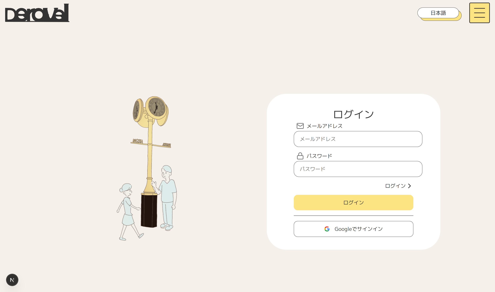
  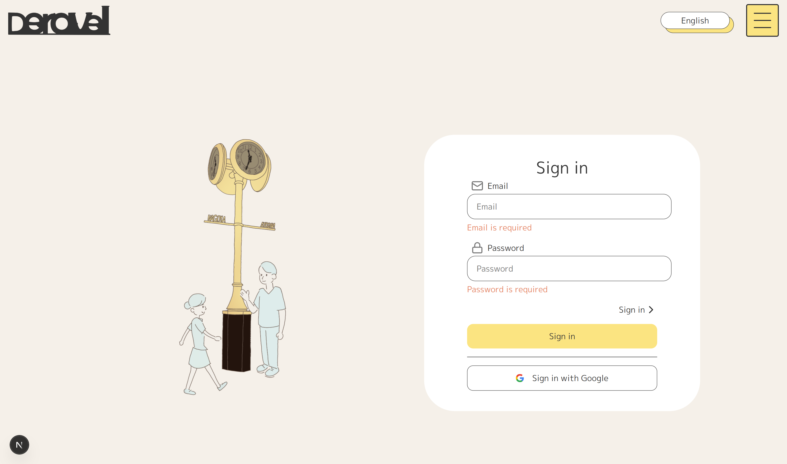

#### できること

- 登録済みのメールアドレスとパスワードでログインできます
- Googleアカウントを使って簡単にログインすることもできます
- 入力フォームやバリデーションエラーについては全て多言語対応しています。

 

---

 

### 2. 新規登録ページ

  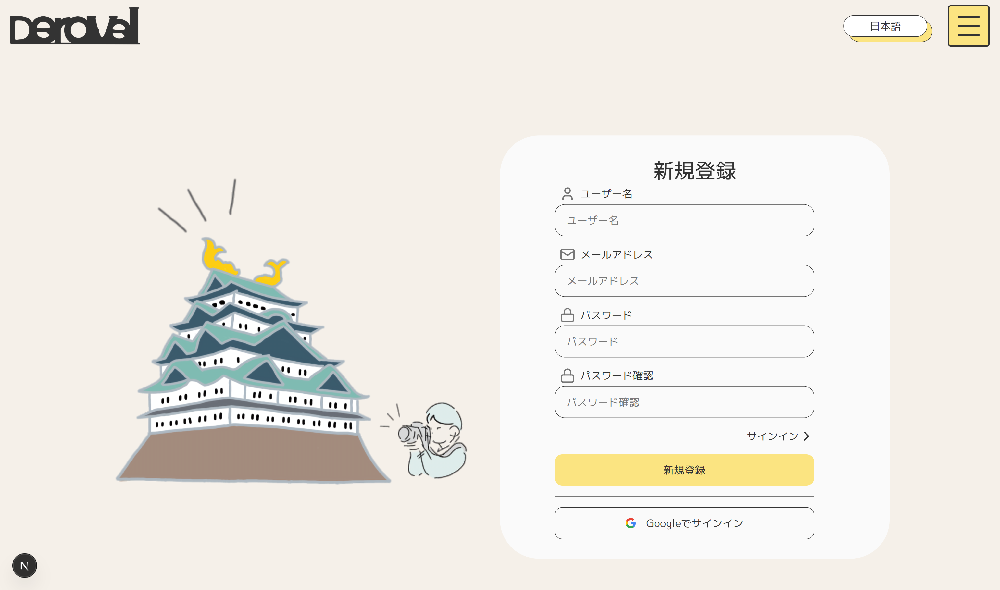
  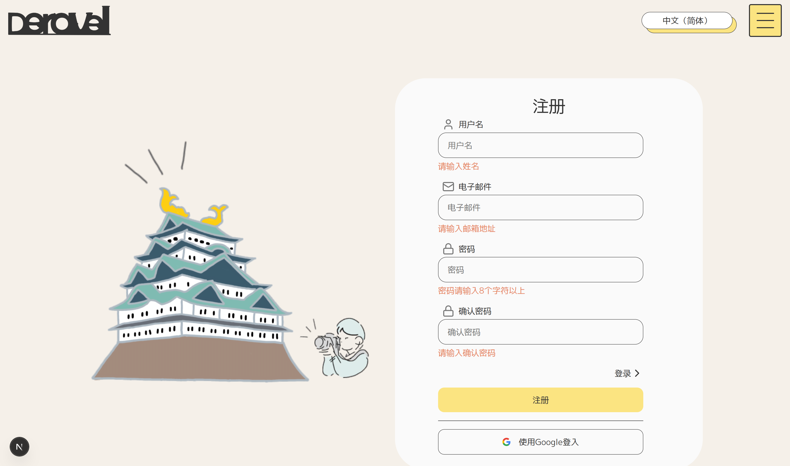

#### できること

- ユーザー名、メールアドレス、パスワードを入力して新規登録ができます
- Googleアカウントによって登録することもできます。
- パスワードは確認のため2回入力します
- 入力フォームやバリデーションエラーについては全て多言語対応しています。
 

---

 

### 3. TOPページ

  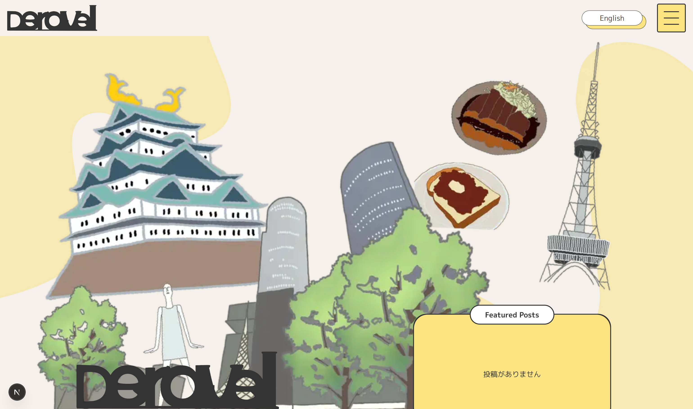
  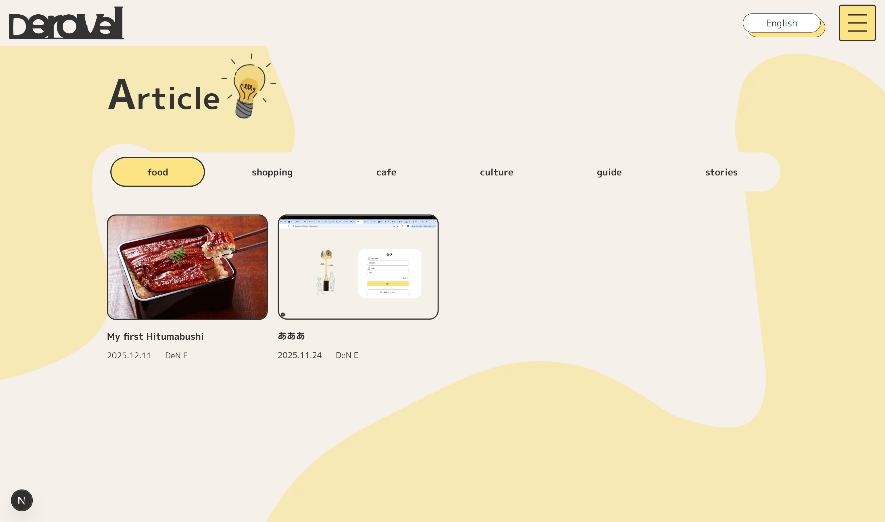

#### できること

- 名古屋をイメージしたビジュアルでアプリの世界観を体感できます
- カテゴリ別の人気記事をチェックできます
- 最新の投稿記事を一覧で確認できます
- 閲覧数の多い人気記事ランキングを見ることができます
- 名古屋の魅力についての紹介文を読むことができます

 

---

 

### 4. カテゴリページ

  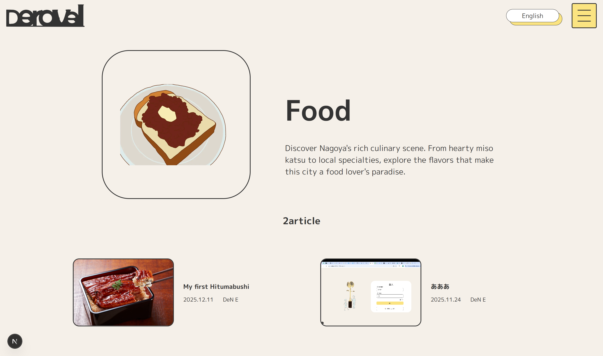
  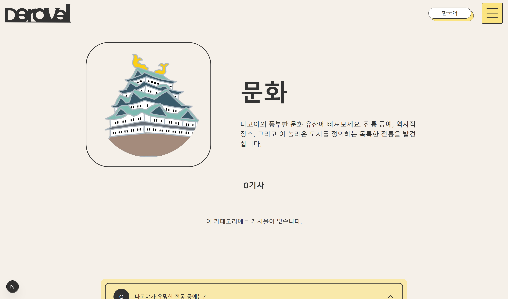

#### できること

- 6つのカテゴリ（グルメ / カフェ / 文化 / ガイド / ショッピング / ストーリー）から興味のあるジャンルを選べます
- 選んだカテゴリに絞って記事を探すことができます
- 各カテゴリに関するQ&A（よくある質問）を確認できます
- 記事が多い場合はページを切り替えて閲覧できます

 

---

 

### 5. 記事投稿ページ

  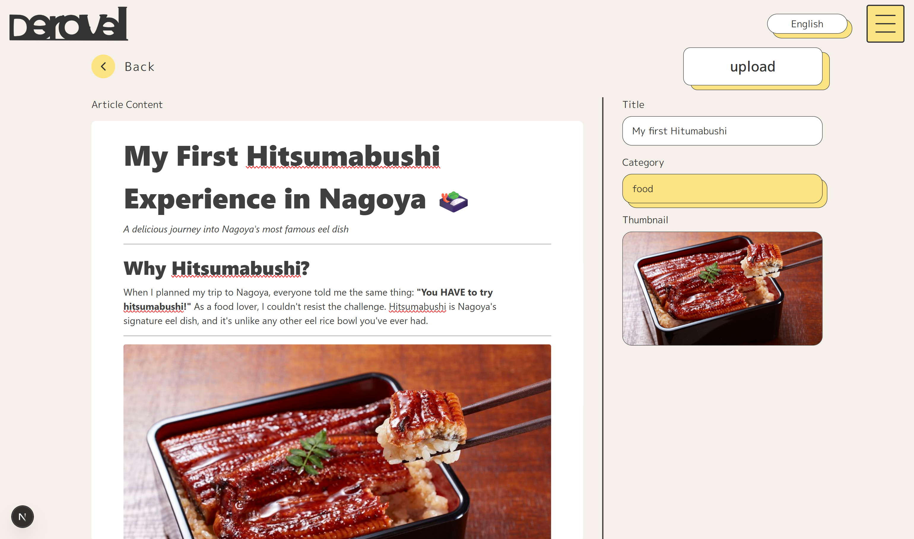
  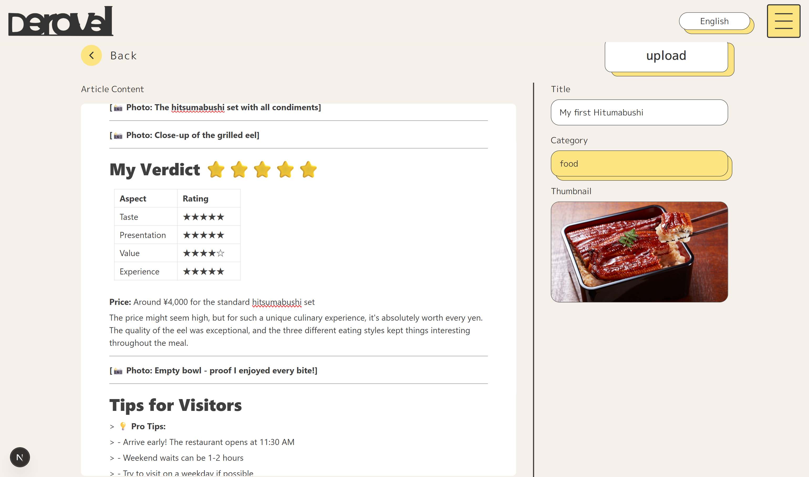

#### できること

- ユーザー登録をした方は、自分の記事を投稿できます
- 投稿には以下の項目を設定します：
  - **サムネイル画像** - 記事の顔となる画像をアップロード
  - **カテゴリ** - 6つのカテゴリから選択
  - **タイトル** - 記事のタイトルを入力
  - **記事本文** - Notionライクなエディターで自由に執筆
- 記事本文はマークダウン形式で、見出し・リスト・画像など好きなように書けます

 

---

 

### 6. 記事詳細ページ

  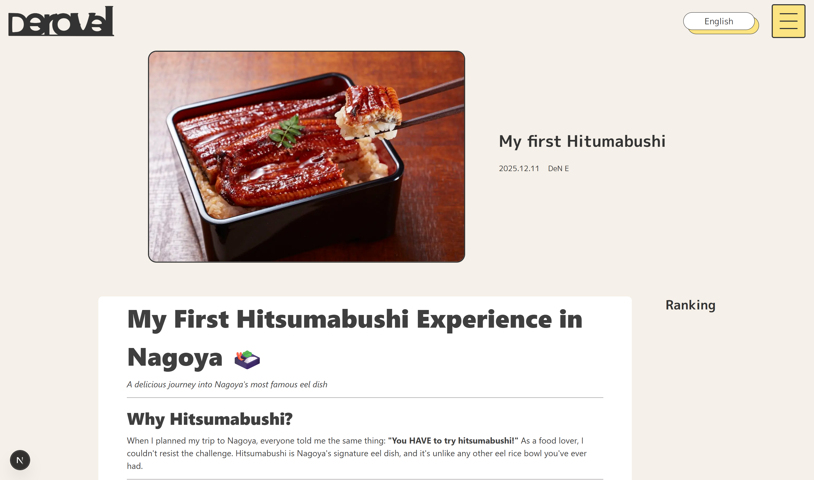
  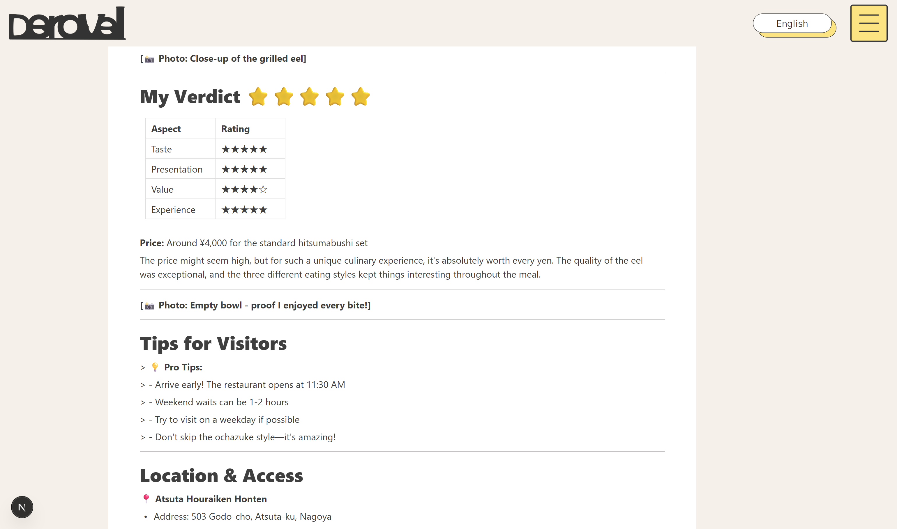

#### できること

- 投稿された記事の全文を読むことができます
- 記事を書いた投稿者の情報を確認できます
- 記事の閲覧数が表示され、人気度がわかります
- 自分が投稿した記事の場合は、編集ページへ移動できます

 

---

 

### 7. プロフィールページ

  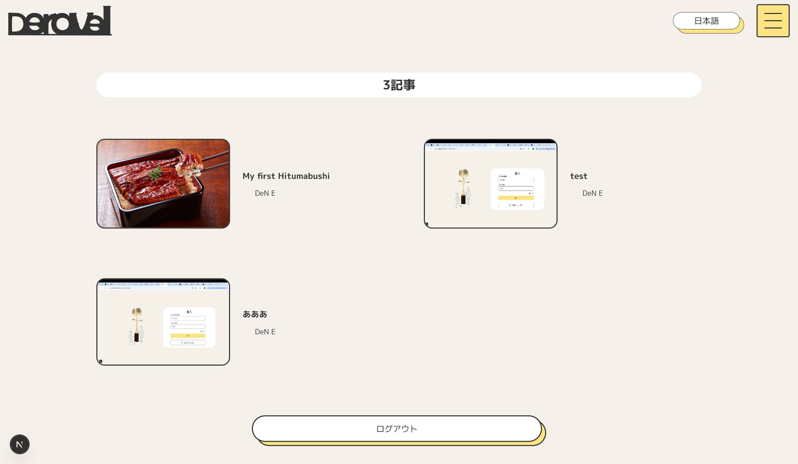
  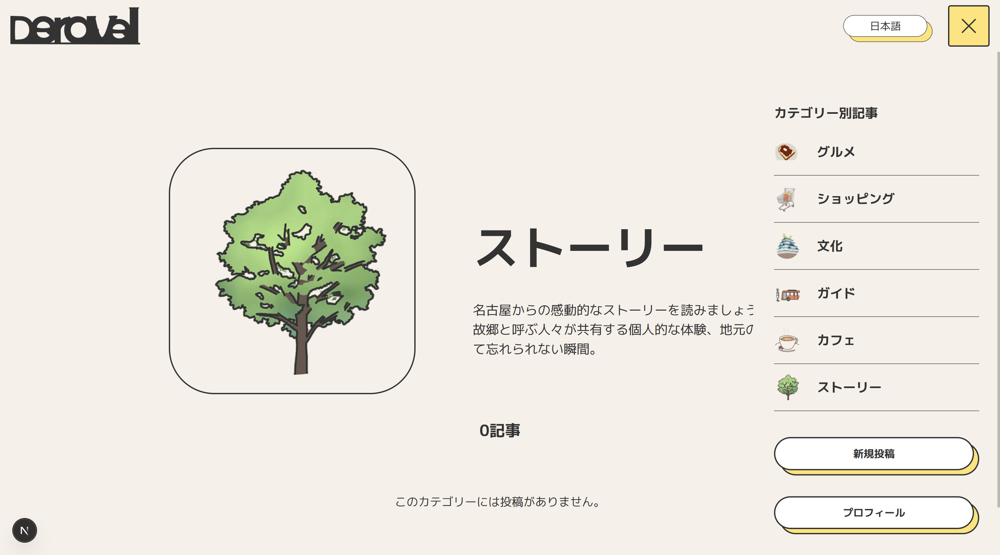

#### できること

- 自分のユーザー名とプロフィールメッセージを確認できます
- 自分が投稿した記事の一覧を見ることができます
- ドロワーメニューから各ページへ簡単にアクセスできます
- ログアウトしてアカウントを切り替えることができます

## できなかったこと、実装できなかった点
- 編集ページへの遷移ボタン、投稿削除機能(APIは作成済み)
- 一部ページのレスポンシブ対応
- メタタグの動的生成